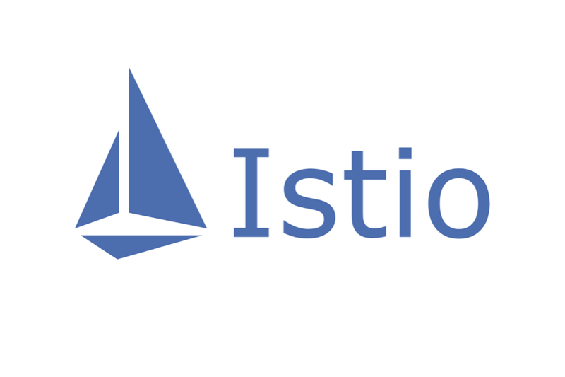

# what is this reposiory?
This repository is an archive of my Kubernetes (k8s) configurations for efficient deployment.

I have stored various configurations in this repository, including Kubernetes manifests, Jenkinsfiles, and Helm charts.

It contains common Kubernetes (k8s) configurations with a Jenkinsfile to set up the pipeline and simplify deployment.

Additionally, I’ve added a git submodule to demonstrate the infrastructure setup of my personal project. You can see how I configure my personal system through submodule repository.

Here is a list of infrastructure tool included in this repository.

  

    
    
calico

  

  

    
    
argo

  

  

    
    
k8s-dashboard

  

  

    
    
k8s-metric-server

  

  

    
    
istio

  

